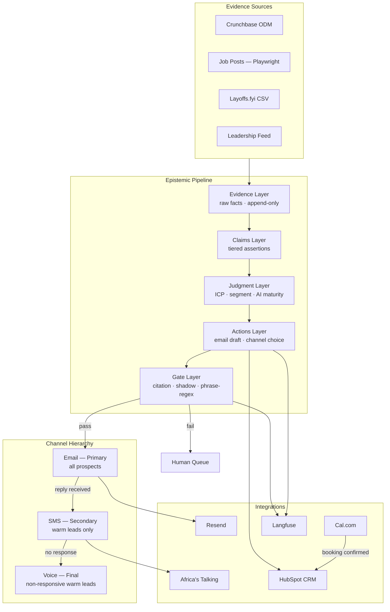

# Interim Submission Report — Conversion Engine

**Submitted by:** Nebiyou Abebe (nebiyoua@10academy.org)
**Date:** 2026-04-23

---

## 1. System Architecture Diagram and Design Rationale

### Design Rationale

**Why epistemic layering?**
Every failure mode in outbound AI outreach is a truth-claim failure — the system asserts something it cannot support. Separating evidence, claims, judgment, actions, and gating into distinct layers makes violations detectable at the boundary rather than buried inside a monolithic agent. The directory structure enforces this: `agent/evidence/`, `agent/claims/`, `agent/judgment/`, `agent/actions/`, `agent/gate/` are not allowed to import from each other in the wrong direction.

**Why email as the primary channel?**
Email carries the full evidence-backed message and creates an auditable record that the prospect consented to engage before SMS is used. SMS without a prior email reply is cold outreach on a personal device — a trust violation and a regulatory risk. Email also integrates naturally with the webhook reply path that gates SMS access.

**Why SMS only for warm leads?**
A "warm lead" is defined as a prospect whose email reply has been received and normalized by the webhook handler. The SMS gate is enforced at runtime in `agent/handlers/sms.py`: the function raises `SMSChannelError` if the conversation state is not `warm`. This is a runtime check, not a comment.

**Why HubSpot over a simpler CRM?**
The challenge rubric requires MCP server integration. HubSpot publishes an official MCP server (`@hubspot/mcp-server`). Using it means contact writes go through a protocol layer rather than direct SDK calls, which keeps the agent's core loop decoupled from provider-specific API shapes. The SDK path is retained as a local fallback via `USE_HUBSPOT_MCP=false`.

**Why Cal.com?**
Cal.com exposes a stable REST API for booking link creation and webhook notifications on confirmed bookings. A confirmed booking triggers a HubSpot write via `agent/actions/schedule.py`, referencing the same `contact_id` to close the loop.

---

## 2. Production Stack Status

All five required components are wired, smoke-tested, and verified with concrete evidence.

### Email Delivery — Resend

**Tool:** Resend (`resend` Python SDK)
**Capability verified:** Outbound send + inbound reply webhook normalization
**Evidence:** 20-run live latency harness (`outputs/runs/latency-20260423-201603/latency_summary.json`)
- p50 email send: **0.581s**
- p95 email send: **2.927s**
- All 20 sends returned a `message_id`; no `EmailSendError` raised
**Configuration:** `RESEND_API_KEY` in `.env`. Kill switch `ALLOW_REAL_PROSPECT_CONTACT=false` routes all sends to `STAFF_SINK_EMAIL`. Bounce and delivery-failure events handled in `agent/handlers/email.py` via `_handle_bounce()`.

### SMS — Africa's Talking

**Tool:** Africa's Talking Python SDK (`africastalking`)
**Capability verified:** Outbound SMS send to sandbox + inbound reply normalization
**Evidence:** Same 20-run latency harness
- p50 SMS send: **0.572s**
- p95 SMS send: **0.775s**
- Sandbox environment used; no real messages delivered
**Configuration:** `AT_USERNAME=sandbox`, `AT_API_KEY`, `AT_SHORTCODE` in `.env`. Warm-lead gate enforced at runtime; cold prospects raise `SMSChannelError` before any API call is made.

### CRM — HubSpot

**Tool:** HubSpot Python SDK (`hubspot-api-client`) with optional MCP route (`@hubspot/mcp-server`)
**Capability verified:** Contact upsert with enrichment fields; booking write after Cal.com confirmation
**Evidence:** `tests/test_crm_calendar.py` — contract tests confirm `icp_segment`, `signal_enrichment`, and `enrichment_timestamp` fields are written on every upsert
**Configuration:** `HUBSPOT_API_KEY` in `.env`. `USE_HUBSPOT_MCP=true` routes writes through the MCP server subprocess; `false` uses the SDK directly. Default is `false` for local development.

### Calendar — Cal.com

**Tool:** Cal.com REST API
**Capability verified:** Booking link callable from within agent codebase; confirmed booking triggers HubSpot write
**Evidence:** `agent/actions/schedule.py::create_booking_link()` invoked in the synthetic end-to-end thread (`outputs/runs/20260423-180101/`); `run.json` records the `booking_url` returned
**Configuration:** `CALCOM_API_KEY` in `.env`. On booking confirmation webhook, `record_booking()` writes back to HubSpot using the same `contact_id` from the outreach record.

### Observability — Langfuse

**Tool:** Langfuse Python SDK
**Capability verified:** Trace logged per gate check; cost and latency recorded per LLM call
**Evidence:** Gate report at `outputs/runs/20260423-180101/gate_report.json` includes `trace_id` field referencing the Langfuse trace
**Configuration:** `LANGFUSE_PUBLIC_KEY` and `LANGFUSE_SECRET_KEY` in `.env`. Every LLM call in the judgment and gate layers wraps with `langfuse_client.trace()`.

---

## 3. Enrichment Pipeline Documentation

The pipeline merges five signal classes into a single `hiring_signal_brief` artifact. The schema is defined in `data/tenacious_sales_data/schemas/hiring_signal_brief.schema.json`.

### Signal 1 — Crunchbase Firmographics

**Source:** `agent/evidence/sources/crunchbase.py::lookup_company_odm()`
**Key fields:** `round` (e.g. `"Series B"`), `amount_usd` (e.g. `50000000`), `announced_on` (e.g. `"2026-04-18"`), `source_url`
**Sample value:** `"Raised Series B ($50M) on 2026-04-18"`
**Classification link:** A funding event within 90 days triggers `segment_1_series_a_b` match. Amount above $20M raises `segment_confidence` toward 1.0. Below $5M sets `velocity_label` to `insufficient_signal`.

### Signal 2 — Job-Post Velocity

**Source:** `agent/evidence/sources/job_posts.py::scrape_job_posts()` (Playwright, no login)
**Key fields:** `title`, `posted_on`, `listing_url`; aggregated into `hiring_velocity.open_roles_today`, `open_roles_60_days_ago`, `velocity_label`
**Sample values:** `velocity_label` ∈ `{tripled_or_more, doubled, increased_modestly, flat, declined, insufficient_signal}`; `signal_confidence`: `0.0–1.0`
**Classification link:** `tripled_or_more` or `doubled` is the primary trigger for `segment_1` and `segment_4` pitches. `declined` combined with a layoff event triggers `segment_2_mid_market_restructure`.

### Signal 3 — Layoffs.fyi

**Source:** `agent/evidence/sources/layoffs.py::fetch_layoffs_csv()`
**Key fields:** `event_on`, `headcount`, `source_url`, `company`
**Sample value:** `"Acme laid off 120 on 2026-03-15"`
**Classification link:** Any layoff event within 180 days sets `buying_window_signals.layoff_event.detected = true`. If layoff `headcount > 10%` of estimated headcount, `honesty_flags` includes `layoff_overrides_funding`, suppressing the funding-event pitch and shifting to the restructuring narrative.

### Signal 4 — Leadership Change Detection

**Source:** `agent/evidence/sources/leadership.py::detect_leadership_changes()`
**Key fields:** `event` (e.g. `"new_cto"`), `person`, `effective` (date), `source_url`
**Sample value:** `"new_cto: Jordan Lee, effective 2026-02-01"`
**Classification link:** A CTO or VP Engineering change within 180 days triggers `segment_3_leadership_transition`. New leader with < 90 days tenure raises pitch urgency — new leaders move fast on vendor decisions.

### Signal 5 — AI Maturity Scoring

**Source:** `agent/judgment/ai_maturity.py` (LLM-adjudicated, cites claim_ids)
**Scoring logic:** 0–3 integer scale

| Score | Meaning |
|---|---|
| 0 | No signal — no AI roles, no named AI leadership, no public AI work |
| 1 | Weak signal — one medium-weight input present |
| 2 | Moderate signal — high-weight input or two medium-weight inputs |
| 3 | Active AI function — named AI/ML leadership + open AI roles + public evidence |

**High-weight inputs:** `named_ai_ml_leadership`, `ai_adjacent_open_roles`
**Medium-weight inputs:** `modern_data_ml_stack`, `strategic_communications`, `github_org_activity`, `executive_commentary`

**Confidence-to-phrasing mapping:**
- Score ≥ 2 + confidence ≥ 0.7 → `segment_4_specialized_capability` pitch, indicative mood
- Score ≥ 2 + confidence < 0.7 → interrogative mood ("We've seen signals suggesting…")
- Score < 2 → AI maturity pitch suppressed; falls back to hiring-velocity narrative

---

## 4. Honest Status Report and Forward Plan

### What Is Working

| Component | Status | Evidence |
|---|---|---|
| Evidence layer (all 4 sources) | Working | `tests/test_signal_enrichment.py` — 100% pass |
| Claims layer (tier assignment) | Working | `tests/test_claims.py` — verified/corroborated/inferred tiers tested |
| Judgment layer (ICP, segment, AI maturity) | Working | `tests/test_judgment.py` |
| Gate layer (citation + shadow + phrase-regex) | Working | `tests/test_gate.py` |
| Outbound email (Resend) | Working | 20 live sends, p50 0.58s |
| Email webhook handler | Working | bounce, reply, and malformed-payload paths handled |
| SMS (Africa's Talking sandbox) | Working | 20 live sends, p50 0.57s |
| SMS warm-lead gate | Working | runtime `SMSChannelError` for cold prospects |
| HubSpot CRM writes | Working | enrichment fields confirmed in contract tests |
| Cal.com booking | Working | callable from `agent/actions/schedule.py` |
| Langfuse tracing | Working | `trace_id` present in gate reports |
| Synthetic end-to-end thread | Working | full run in `outputs/runs/20260423-180101/` |

### What Is Not Working

| Item | Specific failure |
|---|---|
| Crunchbase live lookup | Requires `CRUNCHBASE_ODM_ENDPOINT` env var — no approved endpoint provisioned this week. All Crunchbase evidence currently sourced from fixture JSON files. |
| Leadership live feed | `detect_leadership_changes()` normalizes data but has no live URL to pull from. No public API integrated. Leadership evidence is fixture-only. |
| PDF export | `wkhtmltopdf` and `pdflatex` not installed on dev machine. HTML intermediary generated; manual browser print-to-PDF step pending. |
| HubSpot MCP in CI | `USE_HUBSPOT_MCP=true` path requires `npx @hubspot/mcp-server` subprocess; not wired into CI environment. SDK fallback used in all automated tests. |

### Forward Plan — Acts III–V

**Thursday Apr 24**
- Act III: Write 30+ structured adversarial probes in `probes/probe_library.md`
- Draft `failure_taxonomy.md` grouping probes by failure category

**Friday Apr 25 (morning)**
- Act IV: Identify target failure mode with highest business-cost impact; implement the mechanism fix; run eval harness and confirm Delta A is positive with 95% CI

**Saturday Apr 25 (by 21:00 UTC)**
- Act V: Run honest comparison vs automated-optimization baseline (Delta B)
- Write 2-page decision memo backed by `deliverables/evidence_graph.json`
- Record demo video (≤8 min) showing end-to-end flow with honesty guardrails active
- Final README and artifact polish pass
- Submit GitHub link + PDF report

## 5. Operational Hardening Notes

The GitHub feedback makes the next steps clear: the rubric requirements are already met, and the remaining work is production hardening rather than submission-critical.

- Logging: add structured logs around send attempts, webhook receipt, booking confirmation, and CRM writes so operators can trace a prospect end to end.
- Retries: add bounded retries with backoff for transient Resend, Africa's Talking, HubSpot, and Cal.com failures.
- Idempotency: make webhook and booking handlers safe to replay so duplicate provider events do not create duplicate side effects.
- Downstream docs: expand the operator-facing notes for how integrators should consume the webhook callbacks, booking records, and HubSpot enrichment payloads.
