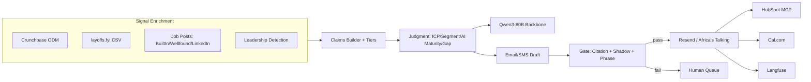

# Architecture

Conversion Engine is organized as an epistemic pipeline. Each layer owns a
different kind of truth claim, and downstream layers consume only the contract
from the previous layer.

```text
EVIDENCE -> CLAIMS -> JUDGMENT -> ACTIONS -> GATE
raw facts  tiered    segment     drafts    pre-send
           claims    decisions   actions   validation
```



## Layer Contracts

| Layer | Directory | Contract |
|---|---|---|
| Evidence | `agent/evidence/` | Append-only raw facts with `source_url`, `retrieved_at`, and `method`. No interpretation. |
| Claims | `agent/claims/` | Derived assertions with confidence tiers and evidence IDs. Below-threshold claims are not actionable downstream. |
| Judgment | `agent/judgment/` | Segment and ICP decisions over claim rows only. AI maturity is LLM-adjudicated when the real judgment path is used. |
| Actions | `agent/actions/` | Drafting, channel choice, and scheduling. Factual sentences must cite claim IDs. |
| Gate | `agent/gate/` | Citation coverage, shadow review, and forbidden phrase checks before send. |

## Integration Boundaries

| Integration | Files | Current verification |
|---|---|---|
| Resend | `integrations/email_client.py`, `agent/handlers/email.py` | Live staff-sink latency run plus handler tests |
| Africa's Talking | `integrations/sms_client.py`, `agent/handlers/sms.py` | Sandbox/staff-sink latency run plus warm-lead gate tests |
| HubSpot SDK | `integrations/hubspot_client.py` | Contract tests with provider mocked |
| HubSpot MCP | `integrations/hubspot_mcp_client.py` | Unit tests for tool discovery and result parsing |
| Cal.com | `integrations/calcom_client.py`, `agent/actions/schedule.py` | Adapter tests and synthetic booking flow |
| Langfuse | `integrations/langfuse_client.py` | Wrapper implemented; current synthetic run does not prove remote trace delivery |

## Measurement Loop

The system is only decision-ready once probe and mechanism claims are backed
by measured trigger rates, not just names and expected behavior. The intended
loop is:

1. run probes and canary flows
2. capture raw counts, denominators, and trigger conditions
3. roll the results into `observed_trigger_rate` fields in the probe library
4. revisit the failure taxonomy with those measurements
5. cite the same telemetry when evaluating whether a mechanism is actually
   suppressing the intended failure mode

## Synthetic Thread Boundary

`agent.core.run_synthetic_thread(live=False)` is a demo/smoke path. It uses
fixture evidence, a hardcoded AI maturity response, and mocked email, HubSpot,
and Cal.com calls. This is useful for exercising the internal pipeline, but it
is not a production-provider end-to-end run.
