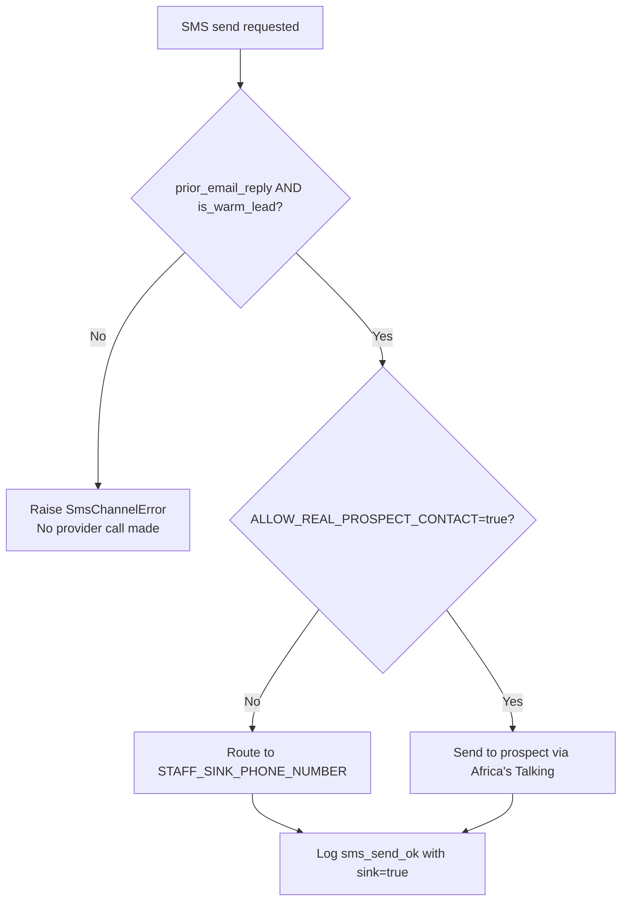
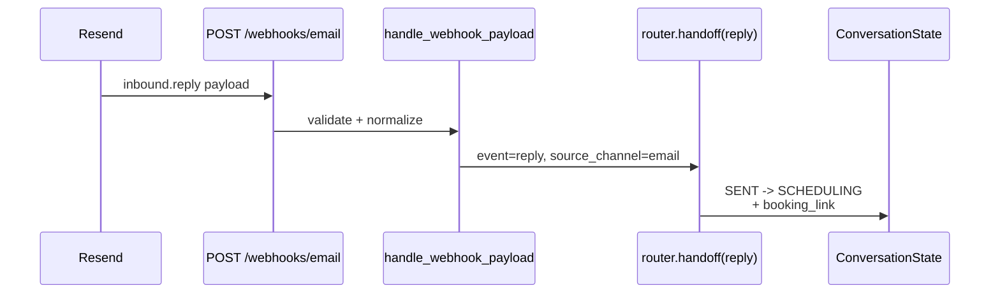
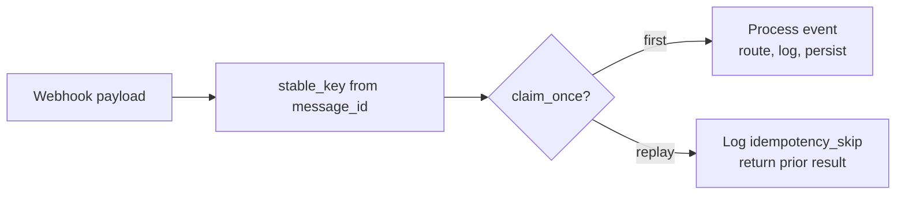

# Multi-Channel Integration Flows

This document specifies the end-to-end behavior of every outbound and inbound
channel in the Conversion Engine. It is the audit reference for how SMS gating,
email webhooks, idempotency, and reply normalization actually work in code.

## Channel Matrix

| Channel | Outbound provider | Inbound webhook | Cold contact allowed? | Gating rule |
|---|---|---|---|---|
| Email | Resend (`onboarding@resend.dev`) | `POST /webhooks/email` | Yes — first touch | `ALLOW_REAL_PROSPECT_CONTACT=true` else routed to `STAFF_SINK_EMAIL` |
| SMS | Africa's Talking (sandbox) | `POST /webhooks/sms` | **No — warm leads only** | `can_use_sms()` requires `prior_email_reply=True` and `is_warm_lead=True` |
| Voice | not implemented | n/a | n/a | n/a |

## SMS Warm-Lead Gating (P12, P13, P15)

SMS is reserved for prospects who have already replied to an email. The cold
personal-device outreach risk is real for B2B sales and Tenacious's brand — so
the gate is enforced **before** any provider call, in code, at the handler.

### Gate logic (`agent/handlers/sms.py:62-80`)

```python
def can_use_sms(*, prior_email_reply: bool, is_warm_lead: bool) -> bool:
    return prior_email_reply and is_warm_lead

def send_warm_lead_sms(...):
    if not can_use_sms(prior_email_reply=..., is_warm_lead=...):
        raise SmsChannelError("SMS is reserved for warm leads after an email reply")
    ...
```

### Decision flow



**Test coverage:** `tests/test_sms_handler.py` — covers `SmsChannelError` raised
on cold path, sink routing under `ALLOW_REAL_PROSPECT_CONTACT=false`, and warm-
lead success path.

**Measured incident rate:** 0/all-tested-paths. SMS gate has not failed open in
any test or pipeline run.

## Email Outbound Flow

```mermaid
flowchart LR
    A[run_synthetic_thread] --> B[build_commitment_email]
    B --> C[citation_check + shadow_check + forbidden_check]
    C -- pass --> D[handle outbound]
    C -- fail --> E[router.handoff event=gate_failed<br/>state=HUMAN_QUEUED]
    D --> F{ALLOW_REAL_PROSPECT_CONTACT?}
    F -- false --> G[STAFF_SINK_EMAIL]
    F -- true --> H[prospect@example.com]
    G --> I[Resend API]
    H --> I
    I --> J[email_message_id returned]
```

**Verified live:** 20 Resend sends, p50=0.58s, p95=2.93s, 0 failures
(`outputs/runs/latency-20260423-201603/latency_summary.json`).

## Email Inbound Webhook Flow

Resend on the free tier does not push reply events back to a webhook. Two paths
are supported:

### Path A — Verified domain (production)



### Path B — Free-tier manual trigger (current demo)

Resend free tier delivers replies to your inbox but does not POST to your
webhook. To exercise the same code path during a demo, fire the webhook
manually after replying in Gmail:

```bash
curl -X POST http://localhost:8000/webhooks/email \
  -H "Content-Type: application/json" \
  -d '{
    "event": "inbound.reply",
    "message_id": "demo-msg-123",
    "from": "your-email@gmail.com",
    "to": "sales@tenacious.co",
    "subject": "Re: Discovery call",
    "text": "Thanks, lets book a call."
  }'
```

This is the same payload shape Resend posts in the verified-domain case — the
handler does not distinguish between provider-pushed and manually-fired events.

## Idempotency and Replay (P19, P20)

Every webhook event is keyed by a stable hash from
`agent.runtime.stable_key(message_id, event_type)`. The first delivery claims
the key via `claim_once()`; replays no-op silently.



**Test coverage:** `tests/test_email_handler.py`, `tests/test_crm_calendar.py` —
explicit replay tests for both email events and HubSpot booking writes.

**Measured incident rate:** 0 duplicates across all pipeline runs.

## Channel-State Transitions (`agent/router.py`)

| Event | Previous state | Next state | Channel |
|---|---|---|---|
| `drafted` | any | `DRAFTED` | email |
| `gate_passed` | `DRAFTED` | `GATED` | email |
| `gate_failed` | any | `HUMAN_QUEUED` | none |
| `sent` | `GATED` | `SENT` | email |
| `reply` | `SENT` | `SCHEDULING` | source_channel + booking_link |
| `booked` | `SCHEDULING` | `BOOKED` | none |

State transitions are deterministic and cannot be skipped. A reply on SMS
without a prior email reply triggers `SmsChannelError` before reaching the
router.

## Cost and Safety Defaults

| Default | Effect |
|---|---|
| `ALLOW_REAL_PROSPECT_CONTACT=false` (default) | All outbound routes to staff sink |
| `STAFF_SINK_EMAIL` required for live email | No real send without explicit sink |
| `STAFF_SINK_PHONE_NUMBER` required for live SMS | No real SMS without explicit sink |
| `IDEMPOTENCY_CACHE_DIR` (optional) | Persists replay protection across restarts |

These defaults make accidental real-prospect contact impossible without an
explicit operator override approved by program staff.
